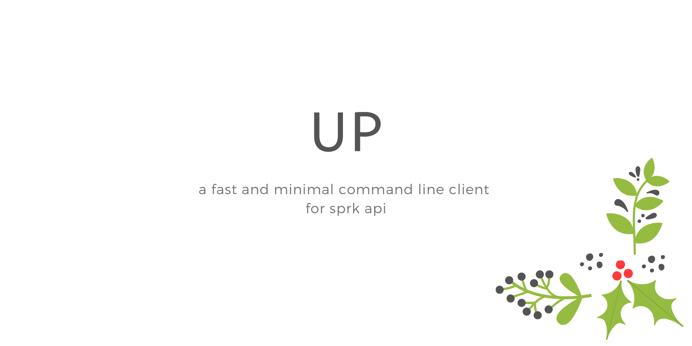

<div align="center">
	<div>
		
	</div>
	<br>
</div>

> a fast and minimal command line client for sprk api

## Install

```sh
$ npm install @pavanjadhaw/up
```

Export sprk environment variables, add this to your .bashrc or .zshrc,
you can get these by setting up [sprk-api](https://github.com/Sparkenstein/sprk)

```sh
export SPRK_SERVER_URL='https://pwnj.pw'
export SPRK_API_KEY='Yhhsnr8kJUmPhjS30ilmd9mCTLQ6pAg0'
```

## Usage

```sh
$ up cutecats.png
# ✔ File uploaded... https://pwnj.pw/koyqd.png
```

This command uploads image(cutecats.png) and returns url of uploaded file https://pwnj.pw/koyqd.png

[](https://asciinema.org/a/2sOXFrfJ3BezscGIQNuK4WcG5)

## Depends

- [sprk-api](https://github.com/Sparkenstein/sprk) - api for this package

## License

MIT © [Pavan Jadhaw](https://pavanjadhaw.me)
